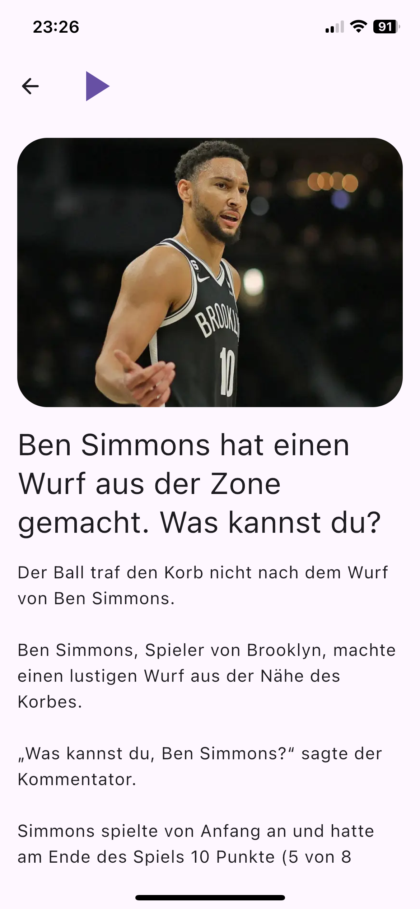

# 📰 Deutschify KMP

A modern news reader app built with Kotlin Multiplatform, showcasing the power of shared code across Android and iOS platforms. The app provides NBA news adapted to A1 German language level, sourced from slamdunk.ru, making it perfect for German language learners interested in basketball.

## 🌟 Features

- 🎯 Cross-platform (Android & iOS)
- 🌓 Dark/Light theme support
- 🔊 Text-to-Speech functionality
- 📱 Responsive UI design
- 🔄 Real-time news updates
- 💾 Offline support
- 🎨 Material Design 3
- 🏀 NBA news in simplified German (A1 level)
- 📚 Language learning-focused content

## 🛠 Tech Stack

- **Kotlin Multiplatform** - Share code between platforms
- **Jetpack Compose** - Modern UI toolkit
- **Material 3** - Latest Material Design components
- **Decompose** - Navigation and lifecycle management
- **KStore** - Data persistence
- **Ktor** - Networking
- **AVFoundation** - iOS audio playback
- **MediaPlayer** - Android audio playback

## 📱 Screenshots

  
  

## 🏗 Architecture

The project follows Clean Architecture principles and is organized into the following modules:

- `app` - Main application module
- `shared` - Common Kotlin code
- `androidApp` - Android-specific code
- `iosApp` - iOS-specific code

## 🚀 Getting Started

### Prerequisites

- Android Studio Arctic Fox or later
- Xcode 13 or later
- JDK 11 or later
- Kotlin 1.8.0 or later

### Building the Project

1. Clone the repository: 